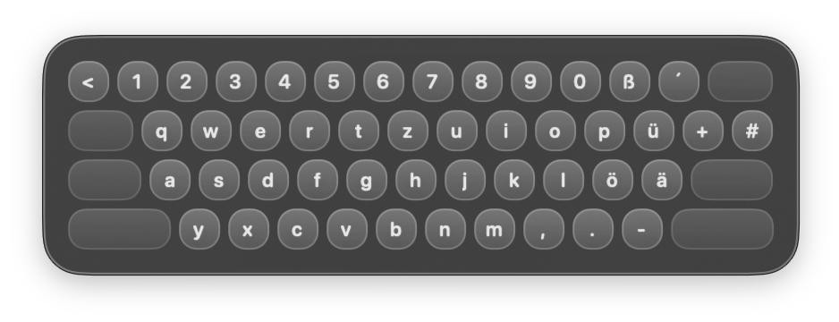

# DEKeyOverlay

A macOS menu bar utility that renders a compact floating overlay for the German MacBook keyboard layout.



https://github.com/user-attachments/assets/8671c87b-845f-4223-9756-4ec0c911d264


## Features

- `Option + Command + K` toggles the overlay
- translucent floating panel with rounded corners
- fully rendered keyboard overlay, no image assets required
- live updates when `Shift` is pressed
- menu bar extra labeled `DEK`

## Development

```bash
swift run
```

## Build A Release App

Use the local packaging script:

```bash
./scripts/build-app.sh
```

This produces:

`dist/DEKeyOverlay.app`
